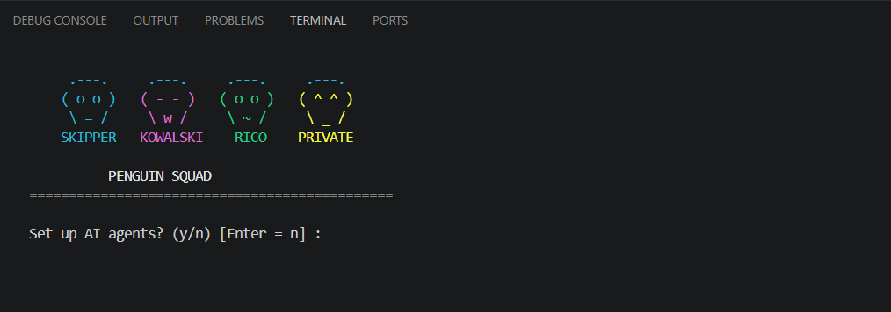
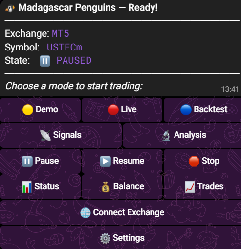

# 🐧 Madagascar Penguins — AI Trading Bot

> Multi-agent trading bot controlled entirely from Telegram.
> Supports MetaTrader 5, Bybit, Binance, OKX, Kraken and more.

---

## What it looks like

**Launch the bot — colorful penguins appear in the terminal:**



**Your full control panel arrives in Telegram:**



---

## How it works

Four AI agents analyse the market together and decide whether to trade:

| Agent | Model | Job |
|---|---|---|
| 🎖 Skipper | GPT-4o | Reads the chart — ICT analysis |
| 🧠 Kowalski | Claude | Checks the risk — approves or rejects |
| 🃏 Rico | DeepSeek | Final yes/no decision |
| 🐧 Private | Telegram | Runs your bot, sends you alerts |

**No API keys?** No problem — every agent falls back to built-in rules automatically.

---

## Installation

### Option A — Windows, one click (easiest)

1. Download **[install.bat](install.bat)**
2. Double-click it — done

---

### Option B — Terminal (Windows / Mac / Linux)

**Step 1 — Install Python** (skip if already installed)

Go to **[python.org/downloads](https://www.python.org/downloads/)** and download Python 3.10+.

> ⚠️ Windows: during install, check **"Add Python to PATH"**

Verify in terminal:
```
python --version
```

---

**Step 2 — Open a terminal**

- **Windows:** press `Win + R`, type `cmd`, press Enter
- **Mac:** press `Cmd + Space`, type `Terminal`, press Enter
- **Linux:** `Ctrl + Alt + T`

---

**Step 3 — Download and install the bot**

```bash
pip install git+https://github.com/YOUR_USERNAME/madagascar-penguins.git
```

> This downloads everything automatically — no manual copying needed.

---

**Step 4 — Run it**

```bash
madagascar-penguins
```

The setup wizard opens and guides you through the rest.

---

### Option C — Clone from source

```bash
git clone https://github.com/YOUR_USERNAME/madagascar-penguins.git
cd madagascar-penguins
pip install -e .
madagascar-penguins
```

---

## First-time setup (5 minutes)

The wizard will ask for three things:

### 1. Telegram bot (required)

This is how you control everything from your phone.

1. Open Telegram → search **@BotFather**
2. Send `/newbot`
3. Choose a name (e.g. `My Trading Bot`)
4. You'll get a token like: `123456789:ABCdef...`
5. Paste it into the wizard

To get your Chat ID:
- Open Telegram → search **@userinfobot** → send `/start`
- It shows your ID (a number like `123456789`)

---

### 2. Exchange (choose one)

| Exchange | What you need | Where to get it |
|---|---|---|
| **MetaTrader 5** | Login + Password + Server | From your broker (Exness, IC Markets, etc.) |
| **Bybit** | API Key + API Secret | bybit.com → Account → API Management |
| **Binance** | API Key + API Secret | binance.com → Profile → API Management |
| **OKX** | API Key + Secret + Passphrase | okx.com → Account → API |
| **Kraken** | API Key + API Secret | kraken.com → Account → API |

> **MetaTrader 5:** You also need to install the MT5 desktop app from your broker.
> Download: **[metatrader5.com/en/download](https://www.metatrader5.com/en/download)**

---

### 3. AI keys — all optional

You can skip all of these. The bot works without them.

| Key | Where | Cost |
|---|---|---|
| OpenAI (Skipper) | [platform.openai.com/api-keys](https://platform.openai.com/api-keys) | ~$5 credit on signup |
| Anthropic (Kowalski) | [console.anthropic.com](https://console.anthropic.com/settings/keys) | ~$5 credit on signup |
| DeepSeek (Rico) | [platform.deepseek.com](https://platform.deepseek.com) | Very cheap |

---

## Using the bot from Telegram

After setup, everything is controlled from your phone. No terminal needed again.

Send `/menu` and you get this:

```
🐧 Madagascar Penguins — Ready!
━━━━━━━━━━━━━━━━━━━━━━━━
[ 🟡 Demo ]  [ 🔴 Live ]  [ 🔵 Backtest ]
[ 📡 Signals ]  [ 🔬 Analysis ]
[ ⏸ Pause ]  [ ▶️ Resume ]  [ 🛑 Stop ]
[ 📊 Status ]  [ 💰 Balance ]  [ 📈 Trades ]
[ 🌐 Connect Exchange ]
[ ⚙️ Settings ]
```

| Button | What it does |
|---|---|
| 🟡 Demo | Paper trading — real prices, fake money |
| 🔴 Live | Real money trading |
| 🔵 Backtest | Test on historical data |
| 📡 Signals | Alerts only, no trades placed |
| 🔬 Analysis | Market analysis only |
| ⏸ / ▶️ | Pause and resume without restarting |
| 🌐 Connect Exchange | Switch exchange or update API keys |
| ⚙️ Settings | Change symbol, risk %, AI keys |

---

## Where are my passwords stored?

**Only on your own computer — never uploaded anywhere:**

```
Windows:   C:\Users\YourName\.penguin_squad\.env
Mac/Linux: /home/yourname/.penguin_squad/.env
```

- ✅ Not synced to OneDrive / iCloud / Dropbox
- ✅ Not on GitHub
- ✅ Not on any server

---

## Supported exchanges

| Exchange | Type |
|---|---|
| MetaTrader 5 | Forex, CFDs, Gold, Indices |
| Bybit | Crypto futures + spot |
| Binance | Crypto futures + spot |
| OKX | Crypto futures + spot |
| Kraken | Crypto spot |
| KuCoin | Crypto spot |
| Gate.io | Crypto spot |
| Bitget | Crypto futures |
| MEXC | Crypto spot |

---

## Requirements

- **Python 3.10+** — [python.org/downloads](https://www.python.org/downloads/)
- **Telegram account** — free, [telegram.org](https://telegram.org)
- **Windows** recommended for MetaTrader 5 (other exchanges work on Mac/Linux too)

---

## Other run options

```bash
madagascar-penguins --mode demo        # force paper trading
madagascar-penguins --mode live        # force live trading
madagascar-penguins --mode backtest    # force backtest
madagascar-penguins --no-orchestrator  # rule-based only, no AI
madagascar-penguins --show-graph       # preview AI pipeline
madagascar-penguins --setup            # re-run AI key wizard
madagascar-penguins --setup-telegram   # re-run Telegram + exchange wizard
```
